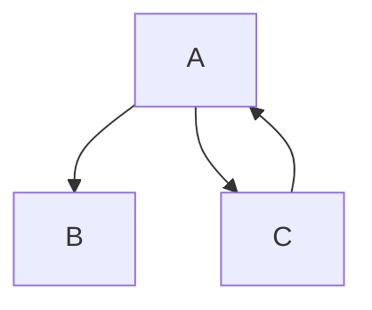

> impmi 简单的依赖注入容器

## 快速开始

依赖关系



实现

```java
@Named("a")
public class A {

    @Inject
    public B b;

    @Inject
    public C c;

    // getter and setter
    // constructor
}

@Named("b")
public class B {

    @Value("hello world!")
    public String name;

    // getter and setter
    // constructor
}

@Named("c")
public class C {

    @Inject
    public A a;

    // getter and setter
    // constructor
}
```

```java
import xnuc.context.Context;

public class Main {
    public static void main(String[] args) throws Exception {
        Context ioc = Context.run(Main.class);
        A a = (A) ioc.get("a");
        System.out.println(a.getC().getA().getB().getName());
    }
}
```


