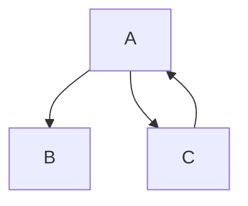

> insni - 轻量的依赖注入容器

`IoC` 控制反转原则让容器接管实例管理, 指导设计出松耦合优良的程序. 

insni 打造了轻量的依赖注入容器, 管理 Java 程序中的实例. 

## 快速开始

假设存在依赖关系



### 类定义

```java
@Named("a")
public class A {
    @Inject
    public B b;
    @Inject
    public C c;
    // getter and setter
    // constructor
}
@Named("b")
public class B {
    @Value("hello world!")
    public String name;
    // getter and setter
    // constructor
}
@Named("c")
public class C {
    @Inject
    public A a;
    // getter and setter
    // constructor
}
```

### Main

```java
import xnuc.context.Context;
import xnuc.example.depend.C;

public class Main {
    public static void main(String[] args) throws Exception {
        Context ioc = Context.run(Main.class);
        C c = (C) ioc.get("c");
        System.out.println(c.getA().getB().getName());
    }
}
```


