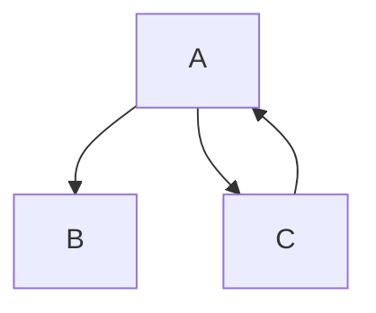

# insni

> insni - 轻量的依赖注入容器

## ioc容器

假设存在依赖关系。



### 快速开始

- DI
    ```java
    @xnuc.ctx.Named("a")
    public class A {
        @xnuc.ctx.Inject
        public B b;
        @xnuc.ctx.Inject
        public C c;
        // getter and setter
        // constructor
    }

    @xnuc.ctx.Named("b")
    public class B {
        @xnuc.ctx.Value("hello world!")
        public String name;
        // getter and setter
        // constructor
    }

    @xnuc.ctx.Named("c")
    public class C implements Runnable {
        @xnuc.ctx.Inject
        public A a;
        // getter and setter
        // constructor
        @Override
        public void run() {
            java.util.logging.Logger.getGlobal().info(String.format("name:%s", a.getB().getName()));
        }
    }
    ```

- IOC
    ```java
    public class Main {
        public static void main(String[] args) throws Exception {
            var ioc = xnuc.ctx.Context.run(Main.class);
            new Thread((Runnable) ioc.get("c")).run();
            Thread.sleep(1000);
        }
    }
    ```
    
    输出：
    ```
    Apr 01, 2023 7:59:54 AM xnuc.example.C run
    INFO: name:hello world!
    ```
